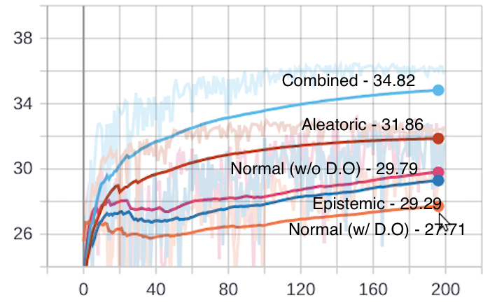
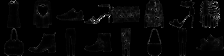
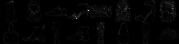

# What Uncertainties Do We Need in Bayesian Deep Learning for Computer Vision?

Pytorch implementation of ["What Uncertainties Do We Need in Bayesian Deep Learning for Computer Vision?", NIPS 2017](https://arxiv.org/abs/1703.04977) 


## 1. Usage

```
# Data Tree
config.data_dir/
└── config.data_name/

# Project Tree
WHAT
├── WHAT_src/
│       ├── data/ *.py
│       ├── loss/ *.py
│       ├── model/ *.py
│       └── *.py
└── WHAT_exp/
         ├── log/
         ├── model/
         └── save/         
```


### 1.1  Train

```
# L2 loss only 
python train.py --uncertainty "normal" --drop_rate 0.

# Epistemic / Aleatoric 
python train.py --uncertainty ["epistemic", "aleatoric"]

# Epistemic + Aleatoric
python train.py --uncertainty "combined"
```


### 1.2 Test

```
# L2 loss only 
python train.py --is_train false --uncertainty "normal"

# Epistemic
python train.py --is_train false --uncertainty "epistemic" --n_samples 25 [or 5, 50]

# Aleatoric
python train.py --is_train false --uncertainty "aleatoric" 

# Epistemic + Aleatoric
python train.py --is_train false --uncertainty "combined" --n_samples 25 [or 5, 50]
```


### 1.3 Requirements

- Python3.7

- Pytorch >= 1.0
- Torchvision
- distutils


## 2. Experiment

This is not official implementation.


### 2.1 Network & Datset

- Autoencoder based on [Bayesian Segnet](https://arxiv.org/abs/1511.02680)

  - Network depth 2 (paper 5)
  - Drop_rate 0.2 (paper 0.5)

- Fahsion MNIST / MNIST

  - Input = Label (for autoencoder)

    

### 2.2 Results

#### 2.2.1 PSNR

Combined > Aleatoric > Normal (w/o D.O) > Epistemic > Normal  (w/ D.O)




#### 2.2.2 Images

  Input / Label

 Combined

 Aleatoric

Epistemic


